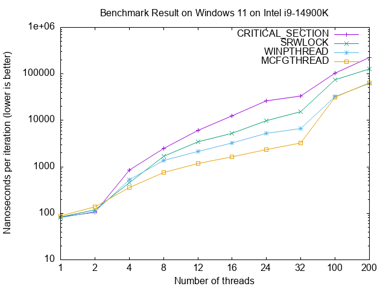
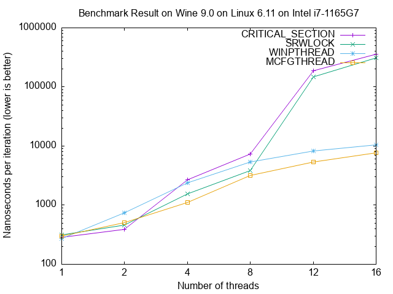

# The MCF Gthread Library

**MCF Gthread** is a threading support library for **Windows 7** and above that
implements the _gthread interface set_, which is used internally both by **GCC**
to provide synchronization of initialization of local static objects, and by
**libstdc++** to provide C++11 threading facilities.

* **cs4k**: Windows `CRITICAL_SECTION` with a spin count of `4000`
* **srw**: Windows `SRWLOCK`
* **boost**: `boost::mutex`
* **mcf0i**: `_MCF_mutex` without inlining

> [!WARNING]
> This project uses some undocumented NT system calls and is not guaranteed to
> work on some Windows versions. The author gives no warranty for this project.
> Use it at your own risk.

## Benchmark Results

This is the result of [a benchmark program](doc/benchmark_mutex.c) on Windows
11 Insider Preview (Dev channel, Build 26300.7760) on an Intel i9-14900K desktop
processor:



This is the result on Wine 9.0 on Linux Mint 22 (kernel 6.11 low-latency) on an
Intel i7-1165G7 mobile processor:



## How to Build

Compiling natively can be done in MSYS2. We take the UCRT64 shell as an example.
Others are similar. Clang shells are also supported.

```sh
pacman -S --noconfirm mingw-w64-ucrt-x86_64-{{headers,crt,tools}-git,gcc,binutils,meson}
meson setup build_debug
cd build_debug
ninja test
```

Cross-compiling from Debian, Ubuntu or Linux Mint is supported. In order to run
tests, Wine is required.

```sh
sudo apt-get install -y --no-install-recommends mingw-w64-{x86-64-dev,tools}  \
        {gcc,g++,binutils}-mingw-w64-x86-64 meson wine wine-binfmt
meson setup --cross-file cross/gcc.x86_64-w64-mingw32 build_debug
cd build_debug
ninja test
```

> [!TIP]
> In order for `__cxa_atexit()` (and the non-standard `__cxa_at_quick_exit()`) to
> conform to the Itanium C++ ABI, it is required 1) for a process to call
> `__cxa_finalize(NULL)` when exiting, and 2) for a DLL to call
> `__cxa_finalize(&__dso_handle)` when it is unloaded dynamically. This requires
> [hacking the CRT](https://github.com/lhmouse/MINGW-packages/blob/0274a6e7e0da258cf5e32efe6e4427454741fa32/mingw-w64-crt-git/9003-crt-Implement-standard-conforming-termination-suppor.patch). If you don't
> have the modified CRT, you may still get standard compliance by 1) calling
> `__MCF_exit()` instead of `exit()` from your program, and 2) calling
> `__cxa_finalize(&__dso_handle)` followed by `fflush(NULL)` upon receipt of
> `DLL_PROCESS_DETACH` in your `DllMain()`.

## Implementation details

### The condition variable

A condition variable is implemented as an atomic counter of threads that are
currently waiting on it. Initially the counter is zero, which means no thread
is waiting.

When a thread is about to start waiting on a condition variable, it increments
the counter and suspends itself using the global keyed event, passing the
address of the condition variable as the key. Another thread may read the
counter to tell how many threads that it will have to wake up (note this has to
be atomic), and release them from the global keyed event, also passing the
address of the condition variable as the key.

### The primitive mutex

A primitive mutex is just a condition variable with a boolean bit, which
designates whether the mutex is LOCKED. A mutex is initialized to all-bit zeroes
which means it is unlocked and no thread is waiting.

When a thread wishes to lock a mutex, it checks whether the LOCKED bit is clear.
If so, it sets the LOCKED bit and returns, having taken ownership of the mutex.
If the LOCKED bit has been set by another thread, it goes to wait on the
condition variable. If the thread wishes to unlock this mutex, it clears the
LOCKED bit and wakes up at most one waiting thread on the condition variable, if
any.

### The 'real' mutex

In reality, critical sections are fairly small. If a thread fails to lock a
mutex, it might be able to do so soon, and we don't want it to give up its time
slice as a syscall is an overkill. Therefore, it is reasonable for a thread to
perform some spinning (busy waiting), before it actually decides to sleep.

This could however lead to severe problems in case of heavy contention. When
there are hundreds of thread attempting to lock the same mutex, the system
scheduler has no idea whether they are spinning or not. As it is likely that a
lot of threads will eventually give up spinning and make a syscall to sleep, we
are wasting a lot of CPU time and aggravating the situation.

This issue is ultimately solved by mcfgthread by encoding a spin failure counter
in each mutex. If a thread gives up spinning because it couldn't lock the mutex
within a given number of iterations, the spin failure counter is incremented. If
a thread locks a mutex successfully while it is spinning, the spin failure
counter is decremented. This counter provides a heuristic way to determine how
heavily a mutex is seized. If there have been many spin failures, newcomers will
not attempt to spin, but will make a syscall to sleep on the mutex directly.

### The once-initialization flag

A once-initialization flag contains a READY byte (this is the first one according
to Itanium ABI) which indicates whether initialization has completed. The other
bytes are used as a primitive mutex.

A thread that sees the READY byte set to non-zero knows initialization has been
done, so it will return immediately. A thread that sees the READY byte set to
zero will lock the bundled primitive mutex, and shall perform initialization
thereafter. If initialization fails, it unlocks the primitive mutex without
setting the READY byte, so the next thread that locks the primitive mutex will
perform initialization. If initialization is successful, it sets the READY byte
and unlocks the primitive mutex, releasing all threads that are waiting on it.
(Do you remember that a primitive mutex actually contains a condition variable?)

### List of imported functions

|Function                       |DLL             |Category                   |
|:------------------------------|:---------------|:------------------------- |
|`BaseGetNamedObjectDirectory`  |KERNEL32        |Undocumented |
|`CreateThread`                 |KERNEL32        |[Windows API](https://learn.microsoft.com/en-us/windows/win32/api/processthreadsapi/nf-processthreadsapi-createthread) |
|`DecodePointer`                |KERNEL32, NTDLL |[Windows API](https://learn.microsoft.com/en-us/previous-versions/bb432242(v=vs.85)) |
|`EncodePointer`                |KERNEL32, NTDLL |[Windows API](https://learn.microsoft.com/en-us/previous-versions/bb432254(v=vs.85)) |
|`ExitThread`                   |KERNEL32        |[Windows API](https://learn.microsoft.com/en-us/windows/win32/api/processthreadsapi/nf-processthreadsapi-exitthread) |
|`FormatMessageW`               |KERNEL32        |[Windows API](https://learn.microsoft.com/en-us/windows/win32/api/winbase/nf-winbase-formatmessagew) |
|`GetCurrentProcessId`          |KERNEL32        |[Windows API](https://learn.microsoft.com/en-us/windows/win32/api/processthreadsapi/nf-processthreadsapi-getcurrentprocessid) |
|`GetLastError`                 |KERNEL32        |[Windows API](https://learn.microsoft.com/en-us/windows/win32/api/errhandlingapi/nf-errhandlingapi-getlasterror) |
|`GetModuleFileNameW`           |KERNEL32        |[Windows API](https://learn.microsoft.com/en-us/windows/win32/api/libloaderapi/nf-libloaderapi-getmodulefilenamew) |
|`GetModuleHandleExW`           |KERNEL32        |[Windows API](https://learn.microsoft.com/en-us/windows/win32/api/libloaderapi/nf-libloaderapi-getmodulehandleexw) |
|`GetProcAddress`               |KERNEL32        |[Windows API](https://learn.microsoft.com/en-us/windows/win32/api/libloaderapi/nf-libloaderapi-getprocaddress) |
|`GetProcessHeap`               |KERNEL32        |[Windows API](https://learn.microsoft.com/en-us/windows/win32/api/heapapi/nf-heapapi-getprocessheap) |
|`GetSystemInfo`                |KERNEL32        |[Windows API](https://learn.microsoft.com/en-us/windows/win32/api/sysinfoapi/nf-sysinfoapi-getsysteminfo) |
|`GetSystemTimeAsFileTime`      |KERNEL32        |[Windows API](https://learn.microsoft.com/en-us/windows/win32/api/sysinfoapi/nf-sysinfoapi-getsystemtimeasfiletime) |
|`GetThreadPriority`            |KERNEL32        |[Windows API](https://learn.microsoft.com/en-us/windows/win32/api/processthreadsapi/nf-processthreadsapi-getthreadpriority) |
|`GetTickCount64`               |KERNEL32        |[Windows API](https://learn.microsoft.com/en-us/windows/win32/api/sysinfoapi/nf-sysinfoapi-gettickcount64) |
|`HeapAlloc`                    |KERNEL32        |[Windows API](https://learn.microsoft.com/en-us/windows/win32/api/heapapi/nf-heapapi-heapalloc) |
|`HeapFree`                     |KERNEL32        |[Windows API](https://learn.microsoft.com/en-us/windows/win32/api/heapapi/nf-heapapi-heapfree) |
|`HeapReAlloc`                  |KERNEL32        |[Windows API](https://learn.microsoft.com/en-us/windows/win32/api/heapapi/nf-heapapi-heaprealloc) |
|`HeapSetInformation`           |KERNEL32        |[Windows API](https://learn.microsoft.com/en-us/windows/win32/api/heapapi/nf-heapapi-heapsetinformation) |
|`HeapSize`                     |KERNEL32        |[Windows API](https://learn.microsoft.com/en-us/windows/win32/api/heapapi/nf-heapapi-heapsize) |
|`NtClose`                      |NTDLL           |[Windows Driver API](https://learn.microsoft.com/en-us/windows-hardware/drivers/ddi/wdm/nf-wdm-zwclose) |
|`NtCreateSection`              |NTDLL           |[Windows Driver API](https://learn.microsoft.com/en-us/windows-hardware/drivers/ddi/wdm/nf-wdm-zwcreatesection) |
|`NtDelayExecution`             |NTDLL           |Undocumented |
|`NtDuplicateObject`            |NTDLL           |[Windows Driver API](https://learn.microsoft.com/en-us/windows-hardware/drivers/ddi/ntifs/nf-ntifs-zwduplicateobject) |
|`NtMapViewOfSection`           |NTDLL           |[Windows Driver API](https://learn.microsoft.com/en-us/windows-hardware/drivers/ddi/wdm/nf-wdm-zwmapviewofsection) |
|`NtRaiseHardError`             |NTDLL           |Undocumented |
|`NtReleaseKeyedEvent`          |NTDLL           |Undocumented |
|`NtUnmapViewOfSection`         |NTDLL           |[Windows Driver API](https://learn.microsoft.com/en-us/windows-hardware/drivers/ddi/wdm/nf-wdm-zwunmapviewofsection) |
|`NtWaitForKeyedEvent`          |NTDLL           |Undocumented |
|`NtWaitForSingleObject`        |NTDLL           |[Windows Driver API](https://learn.microsoft.com/en-us/windows-hardware/drivers/ddi/ntifs/nf-ntifs-zwwaitforsingleobject) |
|`QueryPerformanceCounter`      |KERNEL32        |[Windows API](https://learn.microsoft.com/en-us/windows/win32/api/profileapi/nf-profileapi-queryperformancecounter) |
|`QueryPerformanceFrequency`    |KERNEL32        |[Windows API](https://learn.microsoft.com/en-us/windows/win32/api/profileapi/nf-profileapi-queryperformancefrequency) |
|`QueryUnbiasedInterruptTime`   |KERNEL32        |[Windows API](https://learn.microsoft.com/en-us/windows/win32/api/realtimeapiset/nf-realtimeapiset-queryunbiasedinterrupttime) |
|`RaiseFailFastException`       |KERNEL32        |[Windows API](https://learn.microsoft.com/en-us/windows/win32/api/errhandlingapi/nf-errhandlingapi-raisefailfastexception) |
|`RtlDllShutdownInProgress`     |NTDLL           |[Windows API](https://learn.microsoft.com/en-us/windows/win32/devnotes/rtldllshutdowninprogress)|
|`RtlFillMemory`                |NTDLL           |[Windows Driver API](https://learn.microsoft.com/en-us/windows-hardware/drivers/ddi/wdm/nf-wdm-rtlfillmemory) |
|`RtlMoveMemory`                |NTDLL           |[Windows Driver API](https://learn.microsoft.com/en-us/windows-hardware/drivers/ddi/wdm/nf-wdm-rtlmovememory) |
|`RtlNtStatusToDosError`        |NTDLL           |[Windows Driver API](https://learn.microsoft.com/en-us/windows-hardware/drivers/ddi/ntifs/nf-ntifs-rtlntstatustodoserror) |
|`RtlZeroMemory`                |NTDLL           |[Windows Driver API](https://learn.microsoft.com/en-us/windows-hardware/drivers/ddi/wdm/nf-wdm-rtlzeromemory) |
|`SetConsoleCtrlHandler`        |KERNEL32        |[Windows API](https://learn.microsoft.com/en-us/windows/console/setconsolectrlhandler) |
|`SetLastError`                 |KERNEL32        |[Windows API](https://learn.microsoft.com/en-us/windows/win32/api/errhandlingapi/nf-errhandlingapi-setlasterror) |
|`SetThreadPriority`            |KERNEL32        |[Windows API](https://learn.microsoft.com/en-us/windows/win32/api/processthreadsapi/nf-processthreadsapi-setthreadpriority) |
|`SwitchToThread`               |KERNEL32        |[Windows API](https://learn.microsoft.com/en-us/windows/win32/api/processthreadsapi/nf-processthreadsapi-switchtothread) |
|`TerminateProcess`             |KERNEL32        |[Windows API](https://learn.microsoft.com/en-us/windows/win32/api/processthreadsapi/nf-processthreadsapi-terminateprocess) |
|`TlsAlloc`                     |KERNEL32        |[Windows API](https://learn.microsoft.com/en-us/windows/win32/api/processthreadsapi/nf-processthreadsapi-tlsalloc) |
|`TlsGetValue`                  |KERNEL32        |[Windows API](https://learn.microsoft.com/en-us/windows/win32/api/processthreadsapi/nf-processthreadsapi-tlsgetvalue) |
|`TlsGetValue2`                 |KERNEL32        |[Windows API](https://learn.microsoft.com/en-us/windows/win32/api/processthreadsapi/nf-processthreadsapi-tlsgetvalue2) |
|`TlsSetValue`                  |KERNEL32        |[Windows API](https://learn.microsoft.com/en-us/windows/win32/api/processthreadsapi/nf-processthreadsapi-tlssetvalue) |
|`VirtualProtect`               |KERNEL32        |[Windows API](https://learn.microsoft.com/en-us/windows/win32/api/memoryapi/nf-memoryapi-virtualprotect) |
