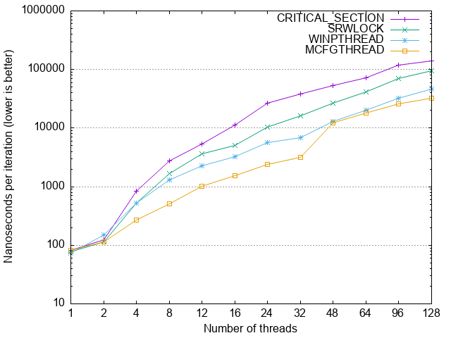
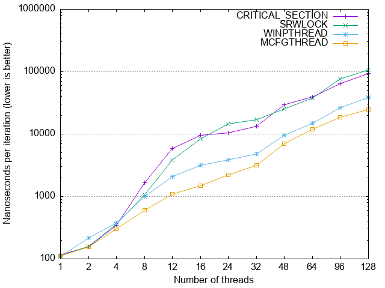
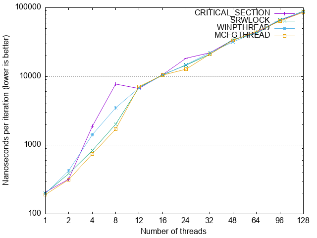
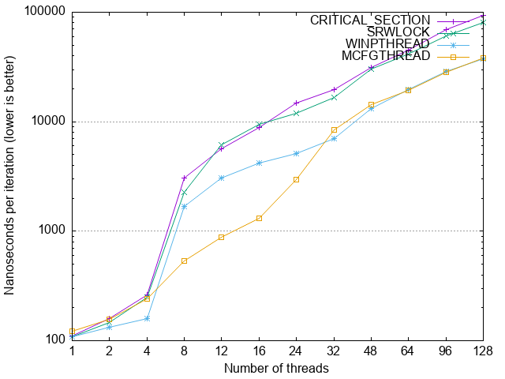
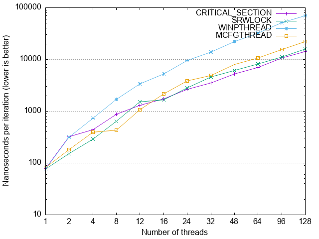
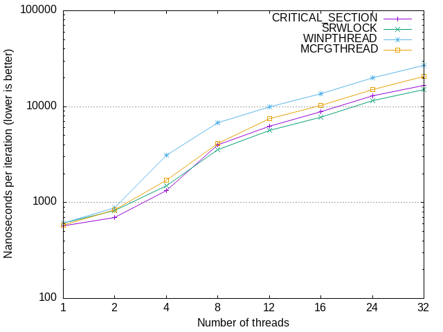

# The MCF Gthread Library

**MCF Gthread** is a threading support library for **Windows 7** and above that
implements the _gthread interface set_, which is used internally both by **GCC**
to provide synchronization of initialization of local static objects, and by
**libstdc++** to provide C++11 threading facilities.

> [!WARNING]
> This project uses some undocumented NT system calls and is not guaranteed to
> work on some Windows versions. The author gives no warranty for this project.
> Use it at your own risk.

## Benchmark Results

This is the result of [a benchmark program](doc/benchmark_mutex.c) on Windows
11 (26H2, build 26200.8737) on an Intel i9-14900K desktop processor (8 P-cores +
16 E-cores, 32 threads):



This is the result on Windows 11 (25H2, build 26200.8655) on an AMD Ryzen 9
9950X3D desktop processor (16 cores, 32 threads; special thanks to @fredyakumo
for testing!):



This is the result on Windows 11 (26H2, build 26200.8737) on a Qualcomm
Snapdragon 8cx Gen 3 mobile processor (8 cores, no hyper-threading):



This is the result on Windows 11 (24H2, build 26100.4652) on an AMD Ryzen 9
7900X desktop processor (12 cores, 24 threads; special thanks to @nmreadelf
for testing!):



This is the result on Windows 7 SP1 on an Intel i7-7700 desktop processor (4
cores, 8 threads):



This is the result on Wine 10.0 on Linux Mint 23 (kernel 7.0 generic HWE) on an
Intel i7-1165G7 mobile processor (4 cores, 8 threads):



## How to Build

#### MSYS2

mcfgthread can be compiled natively in MSYS2. We take the UCRT64 shell as an
example; others are similar. MSYS and CLANG64 shells are also supported.

```sh
pacman -S --noconfirm  \
  mingw-w64-ucrt-x86_64-{headers,crt,gcc,binutils,meson}
```
```sh
meson setup build_dir
cd build_dir
meson compile
meson test
```

> [!TIP]
> In order for `__cxa_atexit()` (and the non-standard `__cxa_at_quick_exit()`) to
> conform to the Itanium C++ ABI, it is required 1) for a process to call
> `__cxa_finalize(NULL)` when exiting, and 2) for a DLL to call
> `__cxa_finalize(&__dso_handle)` when it is unloaded dynamically. This requires
> [hacking the CRT](https://github.com/lhmouse/MINGW-packages/tree/gcc-mcf/mingw-w64-crt).
> If you don't have the modified CRT, you may still get standard compliance by
> 1. calling `__MCF_exit()` instead of `exit()` from your program, and
> 2. calling `__cxa_finalize(&__dso_handle)` followed by `fflush(NULL)` upon
>    receipt of `DLL_PROCESS_DETACH` in your `DllMain()`.

#### Linux

In [cross](cross), there are prefabricated Meson cross files for cross compilation.
In order to run tests, Wine is required. Here are commands for cross-compiling on
Debian, Ubuntu or Linux Mint; if you are using another Linux distribution, you will
need to use some other package manager to install these dependencies.

```sh
sudo apt-get install -y --no-install-recommends  \
  mingw-w64-x86-64-dev {gcc,g++,binutils}-mingw-w64-x86-64 meson  \
  wine wine-binfmt
```
```sh
meson setup --cross-file cross/gcc.x86_64-w64-mingw32 build_dir
cd build_dir
meson compile
meson test  # requires Wine
```

#### Clang for MSVC

It's not possible to build mcfgthread with MSVC. However, it's possible to compile
mcfgthread with Clang to produce libraries that are compatible with MSVC, which
can then be used in Visual Studio projects.

LLVM can be installed with their Windows installers from
<https://github.com/llvm/llvm-project/releases/>.

```sh
meson setup --native-file cross/llvm-windows.x86_64-pc-windows-msvc build_dir
cd build_dir
meson compile
meson test
```

## Implementation Details

#### The condition variable

A condition variable is implemented as an atomic counter of threads that are
currently waiting on it. Initially the counter is zero, which means no thread
is waiting.

When a thread is about to start waiting on a condition variable, it increments
the counter and suspends itself using the global keyed event, passing the
address of the condition variable as the key. Another thread may read the
counter to tell how many threads that it will have to wake up (note this has to
be atomic), and release them from the global keyed event, also passing the
address of the condition variable as the key.

#### The primitive mutex

A primitive mutex is just a condition variable with a boolean bit, which
designates whether the mutex is LOCKED. A mutex is initialized to all-bit zeroes
which means it is unlocked and no thread is waiting.

When a thread wishes to lock a mutex, it checks whether the LOCKED bit is clear.
If so, it sets the LOCKED bit and returns, having taken ownership of the mutex.
If the LOCKED bit has been set by another thread, it goes to wait on the
condition variable. If the thread wishes to unlock this mutex, it clears the
LOCKED bit and wakes up at most one waiting thread on the condition variable, if
any.

#### The 'real' mutex

In reality, critical sections are fairly small. If a thread fails to lock a
mutex, it might be able to do so soon, and we don't want it to give up its time
slice as a syscall is an overkill. Therefore, it is reasonable for a thread to
perform some spinning (busy waiting), before it actually decides to sleep.

This could however lead to severe problems in case of heavy contention. When
there are hundreds of thread attempting to lock the same mutex, the system
scheduler has no idea whether they are spinning or not. As it is likely that a
lot of threads will eventually give up spinning and make a syscall to sleep, we
are wasting a lot of CPU time and aggravating the situation.

This issue is ultimately solved by mcfgthread by encoding a spin failure counter
in each mutex. If a thread gives up spinning because it couldn't lock the mutex
within a given number of iterations, the spin failure counter is incremented. If
a thread locks a mutex successfully while it is spinning, the spin failure
counter is decremented. This counter provides a heuristic way to determine how
heavily a mutex is seized. If there have been many spin failures, newcomers will
not attempt to spin, but will make a syscall to sleep on the mutex directly.

#### The once-initialization flag

A once-initialization flag contains a READY byte (this is the first one according
to Itanium ABI) which indicates whether initialization has completed. The other
bytes are used as a primitive mutex.

A thread that sees the READY byte set to non-zero knows initialization has been
done, so it will return immediately. A thread that sees the READY byte set to
zero will lock the bundled primitive mutex, and shall perform initialization
thereafter. If initialization fails, it unlocks the primitive mutex without
setting the READY byte, so the next thread that locks the primitive mutex will
perform initialization. If initialization is successful, it sets the READY byte
and unlocks the primitive mutex, releasing all threads that are waiting on it.
(Do you remember that a primitive mutex actually contains a condition variable?)

## List of Imported Functions

#### KERNEL32.DLL

|Function                                                 |Availability    |Documentation |
|:--------------------------------------------------------|:---------------|:-------------|
|`BaseGetNamedObjectDirectory`                            |Windows 7       |Undocumented |
|`CreateThread`                                           |All             |[Windows API][ref:CreateThread] |
|`DecodePointer`                                          |Windows XP SP2  |[Windows API][ref:DecodePointer] |
|`EncodePointer`                                          |Windows XP SP2  |[Windows API][ref:EncodePointer] |
|`ExitThread`                                             |All             |[Windows API][ref:ExitThread] |
|`FormatMessageW`                                         |All             |[Windows API][ref:FormatMessageW] |
|`FreeLibrary`                                            |All             |[Windows API][ref:FreeLibrary] |
|`GetCurrentProcessorNumberEx`                            |Windows 7       |[Windows API][ref:GetCurrentProcessorNumberEx] |
|`GetLastError`                                           |All             |[Windows API][ref:GetLastError] |
|`GetLogicalProcessorInformationEx`                       |Windows 7       |[Windows API][ref:GetLogicalProcessorInformationEx] |
|`GetModuleFileNameW`                                     |All             |[Windows API][ref:GetModuleFileNameW] |
|`GetModuleHandleExW`                                     |Windows XP      |[Windows API][ref:GetModuleHandleExW] |
|`GetProcAddress`                                         |All             |[Windows API][ref:GetProcAddress] |
|`GetProcessAffinityMask`                                 |Windows NT 3.5  |[Windows API][ref:GetProcessAffinityMask] |
|`GetProcessHeap`                                         |All             |[Windows API][ref:GetProcessHeap] |
|`GetStdHandle`                                           |All             |[Windows API][ref:GetStdHandle] |
|`GetSystemCpuSetInformation` <sub>optional</sub>         |Windows 10      |[Windows API][ref:GetSystemCpuSetInformation] |
|`GetSystemInfo`                                          |All             |[Windows API][ref:GetSystemInfo] |
|`GetSystemTimeAsFileTime`                                |Windows NT 3.5  |[Windows API][ref:GetSystemTimeAsFileTime] |
|`GetSystemTimePreciseAsFileTime` <sub>optional</sub>     |Windows 8       |[Windows API][ref:GetSystemTimePreciseAsFileTime] |
|`GetThreadGroupAffinity`                                 |Windows 7       |[Windows API][ref:GetThreadGroupAffinity] |
|`GetThreadPriority`                                      |All             |[Windows API][ref:GetThreadPriority] |
|`GetThreadSelectedCpuSets` <sub>optional</sub>           |Windows 10      |[Windows API][ref:GetThreadSelectedCpuSets] |
|`HeapAlloc`                                              |All             |[Windows API][ref:HeapAlloc] |
|`HeapFree`                                               |All             |[Windows API][ref:HeapFree] |
|`HeapReAlloc`                                            |All             |[Windows API][ref:HeapReAlloc] |
|`HeapSetInformation`                                     |Windows XP      |[Windows API][ref:HeapSetInformation] |
|`HeapSize`                                               |All             |[Windows API][ref:HeapSize] |
|`K32EnumProcessModules`                                  |Windows 7       |[Windows API][ref:K32EnumProcessModules] |
|`LoadLibraryExW`                                         |All             |[Windows API][ref:LoadLibraryExW] |
|`QueryPerformanceCounter`                                |Windows NT 3.1  |[Windows API][ref:QueryPerformanceCounter] |
|`QueryPerformanceFrequency`                              |Windows NT 3.1  |[Windows API][ref:QueryPerformanceFrequency] |
|`QueryUnbiasedInterruptTime`                             |Windows 7       |[Windows API][ref:QueryUnbiasedInterruptTime] |
|`RaiseFailFastException`                                 |Windows 7       |[Windows API][ref:RaiseFailFastException] |
|`SetConsoleCtrlHandler`                                  |All             |[Windows API][ref:SetConsoleCtrlHandler] |
|`SetLastError`                                           |All             |[Windows API][ref:SetLastError] |
|`SetThreadAffinityMask`                                  |Windows NT 3.5  |[Windows API][ref:SetThreadAffinityMask] |
|`SetThreadPriority`                                      |All             |[Windows API][ref:SetThreadPriority] |
|`SetThreadSelectedCpuSets` <sub>optional</sub>           |Windows 10      |[Windows API][ref:SetThreadSelectedCpuSets] |
|`SwitchToThread`                                         |Windows NT 4.0  |[Windows API][ref:SwitchToThread] |
|`TerminateProcess`                                       |All             |[Windows API][ref:TerminateProcess] |
|`TlsAlloc`                                               |All             |[Windows API][ref:TlsAlloc] |
|`TlsGetValue`                                            |All             |[Windows API][ref:TlsGetValue] |
|`TlsGetValue2` <sub>optional</sub>                       |Windows 11 24H2 |[Windows API][ref:TlsGetValue2] |
|`TlsSetValue`                                            |All             |[Windows API][ref:TlsSetValue] |
|`VirtualProtect`                                         |All             |[Windows API][ref:VirtualProtect] |
|`WriteConsoleW`                                          |All             |[Windows API][ref:WriteConsoleW] |

[ref:CreateThread]: https://learn.microsoft.com/en-us/windows/win32/api/processthreadsapi/nf-processthreadsapi-createthread
[ref:DecodePointer]: https://learn.microsoft.com/en-us/previous-versions/bb432242(v=vs.85)
[ref:EncodePointer]: https://learn.microsoft.com/en-us/previous-versions/bb432254(v=vs.85)
[ref:ExitThread]: https://learn.microsoft.com/en-us/windows/win32/api/processthreadsapi/nf-processthreadsapi-exitthread
[ref:FormatMessageW]: https://learn.microsoft.com/en-us/windows/win32/api/winbase/nf-winbase-formatmessagew
[ref:FreeLibrary]: https://learn.microsoft.com/en-us/windows/win32/api/libloaderapi/nf-libloaderapi-freelibrary
[ref:GetCurrentProcessorNumberEx]: https://learn.microsoft.com/en-us/windows/win32/api/processthreadsapi/nf-processthreadsapi-getcurrentprocessornumberex
[ref:GetLastError]: https://learn.microsoft.com/en-us/windows/win32/api/errhandlingapi/nf-errhandlingapi-getlasterror
[ref:GetLogicalProcessorInformationEx]: https://learn.microsoft.com/en-us/windows/win32/api/sysinfoapi/nf-sysinfoapi-getlogicalprocessorinformationex
[ref:GetModuleFileNameW]: https://learn.microsoft.com/en-us/windows/win32/api/libloaderapi/nf-libloaderapi-getmodulefilenamew
[ref:GetModuleHandleExW]: https://learn.microsoft.com/en-us/windows/win32/api/libloaderapi/nf-libloaderapi-getmodulehandleexw
[ref:GetProcAddress]: https://learn.microsoft.com/en-us/windows/win32/api/libloaderapi/nf-libloaderapi-getprocaddress
[ref:GetProcessAffinityMask]: https://learn.microsoft.com/en-us/windows/win32/api/winbase/nf-winbase-getprocessaffinitymask
[ref:GetProcessHeap]: https://learn.microsoft.com/en-us/windows/win32/api/heapapi/nf-heapapi-getprocessheap
[ref:GetStdHandle]: https://learn.microsoft.com/en-us/windows/console/getstdhandle
[ref:GetSystemCpuSetInformation]: https://learn.microsoft.com/en-us/windows/win32/api/processthreadsapi/nf-processthreadsapi-getsystemcpusetinformation
[ref:GetSystemInfo]: https://learn.microsoft.com/en-us/windows/win32/api/sysinfoapi/nf-sysinfoapi-getsysteminfo
[ref:GetSystemTimeAsFileTime]: https://learn.microsoft.com/en-us/windows/win32/api/sysinfoapi/nf-sysinfoapi-getsystemtimeasfiletime
[ref:GetSystemTimePreciseAsFileTime]: https://learn.microsoft.com/en-us/windows/win32/api/sysinfoapi/nf-sysinfoapi-getsystemtimepreciseasfiletime
[ref:GetThreadGroupAffinity]: https://learn.microsoft.com/en-us/windows/win32/api/processtopologyapi/nf-processtopologyapi-getthreadgroupaffinity
[ref:GetThreadPriority]: https://learn.microsoft.com/en-us/windows/win32/api/processthreadsapi/nf-processthreadsapi-getthreadpriority
[ref:GetThreadSelectedCpuSets]: https://learn.microsoft.com/en-us/windows/win32/api/processthreadsapi/nf-processthreadsapi-getthreadselectedcpusets
[ref:HeapAlloc]: https://learn.microsoft.com/en-us/windows/win32/api/heapapi/nf-heapapi-heapalloc
[ref:HeapFree]: https://learn.microsoft.com/en-us/windows/win32/api/heapapi/nf-heapapi-heapfree
[ref:HeapReAlloc]: https://learn.microsoft.com/en-us/windows/win32/api/heapapi/nf-heapapi-heaprealloc
[ref:HeapSetInformation]: https://learn.microsoft.com/en-us/windows/win32/api/heapapi/nf-heapapi-heapsetinformation
[ref:HeapSize]: https://learn.microsoft.com/en-us/windows/win32/api/heapapi/nf-heapapi-heapsize
[ref:K32EnumProcessModules]: https://learn.microsoft.com/en-us/windows/win32/api/psapi/nf-psapi-enumprocessmodules
[ref:LoadLibraryExW]: https://learn.microsoft.com/en-us/windows/win32/api/libloaderapi/nf-libloaderapi-loadlibraryexw
[ref:QueryPerformanceCounter]: https://learn.microsoft.com/en-us/windows/win32/api/profileapi/nf-profileapi-queryperformancecounter
[ref:QueryPerformanceFrequency]: https://learn.microsoft.com/en-us/windows/win32/api/profileapi/nf-profileapi-queryperformancefrequency
[ref:QueryUnbiasedInterruptTime]: https://learn.microsoft.com/en-us/windows/win32/api/realtimeapiset/nf-realtimeapiset-queryunbiasedinterrupttime
[ref:RaiseFailFastException]: https://learn.microsoft.com/en-us/windows/win32/api/errhandlingapi/nf-errhandlingapi-raisefailfastexception
[ref:SetConsoleCtrlHandler]: https://learn.microsoft.com/en-us/windows/console/setconsolectrlhandler
[ref:SetLastError]: https://learn.microsoft.com/en-us/windows/win32/api/errhandlingapi/nf-errhandlingapi-setlasterror
[ref:SetThreadAffinityMask]: https://learn.microsoft.com/en-us/windows/win32/api/winbase/nf-winbase-setthreadaffinitymask
[ref:SetThreadPriority]: https://learn.microsoft.com/en-us/windows/win32/api/processthreadsapi/nf-processthreadsapi-setthreadpriority
[ref:SetThreadSelectedCpuSets]: https://learn.microsoft.com/en-us/windows/win32/api/processthreadsapi/nf-processthreadsapi-setthreadselectedcpusets
[ref:SwitchToThread]: https://learn.microsoft.com/en-us/windows/win32/api/processthreadsapi/nf-processthreadsapi-switchtothread
[ref:TerminateProcess]: https://learn.microsoft.com/en-us/windows/win32/api/processthreadsapi/nf-processthreadsapi-terminateprocess
[ref:TlsAlloc]: https://learn.microsoft.com/en-us/windows/win32/api/processthreadsapi/nf-processthreadsapi-tlsalloc
[ref:TlsGetValue]: https://learn.microsoft.com/en-us/windows/win32/api/processthreadsapi/nf-processthreadsapi-tlsgetvalue
[ref:TlsGetValue2]: https://learn.microsoft.com/en-us/windows/win32/api/processthreadsapi/nf-processthreadsapi-tlsgetvalue2
[ref:TlsSetValue]: https://learn.microsoft.com/en-us/windows/win32/api/processthreadsapi/nf-processthreadsapi-tlssetvalue
[ref:VirtualProtect]: https://learn.microsoft.com/en-us/windows/win32/api/memoryapi/nf-memoryapi-virtualprotect
[ref:WriteConsoleW]: https://learn.microsoft.com/en-us/windows/console/writeconsole

#### KERNELBASE.DLL

|Function                                                 |Availability    |Documentation |
|:--------------------------------------------------------|:---------------|:-------------|
|`QueryInterruptTimePrecise` <sub>optional</sub>          |Windows 10      |[Windows API][ref:QueryInterruptTimePrecise] |
|`QueryUnbiasedInterruptTimePrecise` <sub>optional</sub>  |Windows 10      |[Windows API][ref:QueryUnbiasedInterruptTimePrecise] |

[ref:QueryInterruptTimePrecise]: https://learn.microsoft.com/en-us/windows/win32/api/realtimeapiset/nf-realtimeapiset-queryinterrupttimeprecise
[ref:QueryUnbiasedInterruptTimePrecise]: https://learn.microsoft.com/en-us/windows/win32/api/realtimeapiset/nf-realtimeapiset-queryunbiasedinterrupttimeprecise

#### NTDLL.DLL

|Function                                                 |Availability    |Documentation |
|:--------------------------------------------------------|:---------------|:-------------|
|`NtClose`                                                |All             |[Windows Driver API][ref:NtClose] |
|`NtCreateSection`                                        |All             |[Windows Driver API][ref:NtCreateSection] |
|`NtDelayExecution`                                       |All             |Undocumented |
|`NtDuplicateObject`                                      |All             |[Windows Driver API][ref:NtDuplicateObject] |
|`NtMapViewOfSection`                                     |All             |[Windows Driver API][ref:NtMapViewOfSection] |
|`NtRaiseHardError`                                       |All             |Undocumented |
|`NtReleaseKeyedEvent`                                    |Windows XP      |Undocumented |
|`NtUnmapViewOfSection`                                   |All             |[Windows Driver API][ref:NtUnmapViewOfSection] |
|`NtWaitForKeyedEvent`                                    |Windows XP      |Undocumented |
|`NtWaitForSingleObject`                                  |All             |[Windows Driver API][ref:NtWaitForSingleObject] |
|`RtlDllShutdownInProgress`                               |Windows XP      |[Windows API][ref:RtlDllShutdownInProgress]|
|`RtlFillMemory`                                          |All             |[Windows Driver API][ref:RtlFillMemory] |
|`RtlMoveMemory`                                          |All             |[Windows Driver API][ref:RtlMoveMemory] |
|`RtlNtStatusToDosError`                                  |All             |[Windows Driver API][ref:RtlNtStatusToDosError] |
|`RtlZeroMemory`                                          |All             |[Windows Driver API][ref:RtlZeroMemory] |

[ref:NtClose]: https://learn.microsoft.com/en-us/windows-hardware/drivers/ddi/wdm/nf-wdm-zwclose
[ref:NtCreateSection]: https://learn.microsoft.com/en-us/windows-hardware/drivers/ddi/wdm/nf-wdm-zwcreatesection
[ref:NtDuplicateObject]: https://learn.microsoft.com/en-us/windows-hardware/drivers/ddi/ntifs/nf-ntifs-zwduplicateobject
[ref:NtMapViewOfSection]: https://learn.microsoft.com/en-us/windows-hardware/drivers/ddi/wdm/nf-wdm-zwmapviewofsection
[ref:NtUnmapViewOfSection]: https://learn.microsoft.com/en-us/windows-hardware/drivers/ddi/wdm/nf-wdm-zwunmapviewofsection
[ref:NtWaitForSingleObject]: https://learn.microsoft.com/en-us/windows-hardware/drivers/ddi/ntifs/nf-ntifs-zwwaitforsingleobject
[ref:RtlDllShutdownInProgress]: https://learn.microsoft.com/en-us/windows/win32/devnotes/rtldllshutdowninprogress
[ref:RtlFillMemory]: https://learn.microsoft.com/en-us/windows-hardware/drivers/ddi/wdm/nf-wdm-rtlfillmemory
[ref:RtlMoveMemory]: https://learn.microsoft.com/en-us/windows-hardware/drivers/ddi/wdm/nf-wdm-rtlmovememory
[ref:RtlNtStatusToDosError]: https://learn.microsoft.com/en-us/windows-hardware/drivers/ddi/ntifs/nf-ntifs-rtlntstatustodoserror
[ref:RtlZeroMemory]: https://learn.microsoft.com/en-us/windows-hardware/drivers/ddi/wdm/nf-wdm-rtlzeromemory
